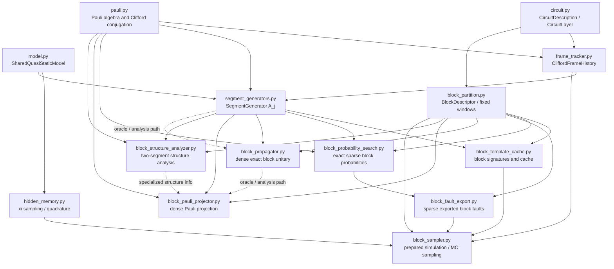

# Architecture Diagram

This page gives a high-level Mermaid view of the `src/lichen/` module
architecture.

It is intentionally structural, not exhaustive. The goal is to show the main
dataflow for the current blockwise hidden-memory simulator:

- model and ideal circuit input,
- cumulative Clifford frame tracking,
- segment-generator construction,
- block partitioning,
- exact block probability construction,
- sparse export and sampled blockwise process output.

## Reading Guide

- `model.py` and `circuit.py` define the physical parameters and ideal control circuit.
- `frame_tracker.py` turns the ideal circuit into cumulative Clifford prefixes.
- `segment_generators.py` builds the toggling-frame generators `A_j`.
- `block_partition.py` groups raw segments into contiguous blocks.
- `block_probability_search.py` is the main exact sparse runtime path for block probabilities.
- `block_fault_export.py` turns exact block probabilities into sparse simulator-facing exports.
- `block_sampler.py` samples one hidden-memory value per shot and one block fault per block.
- `block_propagator.py`, `block_pauli_projector.py`, and `block_structure_analyzer.py` are the dense oracle / analysis side.

## Main Runtime Path

For the current prepared Monte Carlo workflow, the main path is:

1. `model.py` + `circuit.py`
2. `frame_tracker.py`
3. `segment_generators.py`
4. `block_partition.py`
5. `block_probability_search.py`
6. `block_fault_export.py`
7. `block_sampler.py`

The dense propagator / projector modules are mainly used for oracle checks,
analysis, and theory-facing cross-checks rather than the default runtime path.
